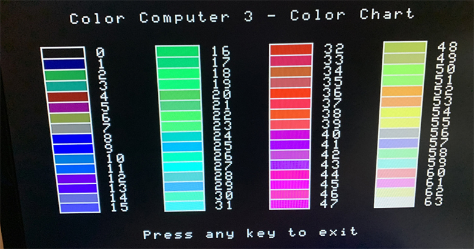

CHART: COCO3 color chart
==========

Dale Lear and I wrote a color chart program for the Coco3 for Rainbow back in January, 1987.  However, that version had
glitches down the left side of the screen from switching the palette registers too sloppily.

So I decided to revisit that and try to fix that annoying problem... and I did!

I also converted the BASIC program to use my BASIC preprocessor to make the code all pretty.

_Originally from the Rainbow January 1987 article "Color Chart for Coco3" by Rick Adams and Dale Lear._

_Altered to fix the palette glitches in the original, 35 years later, by Rick Adams._
